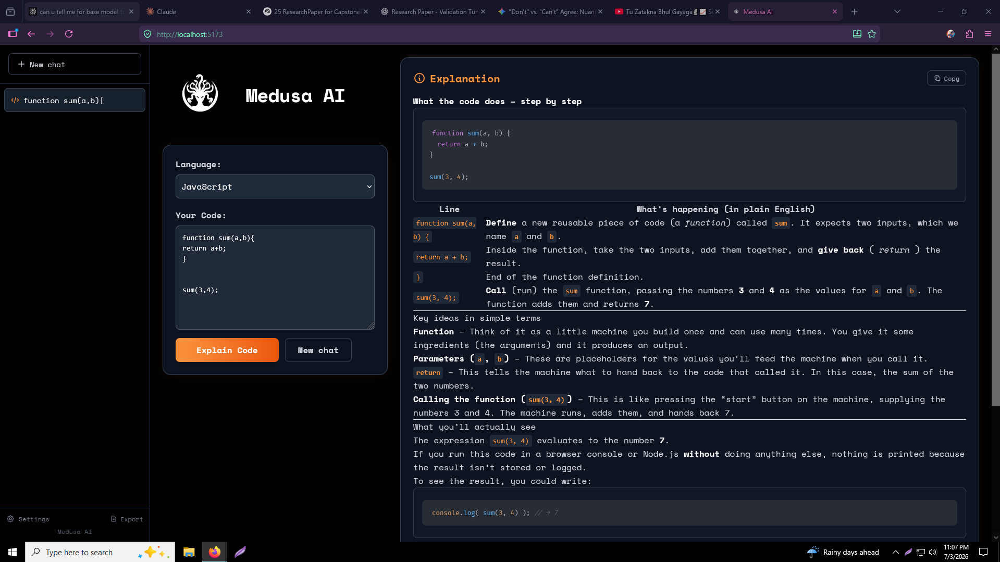
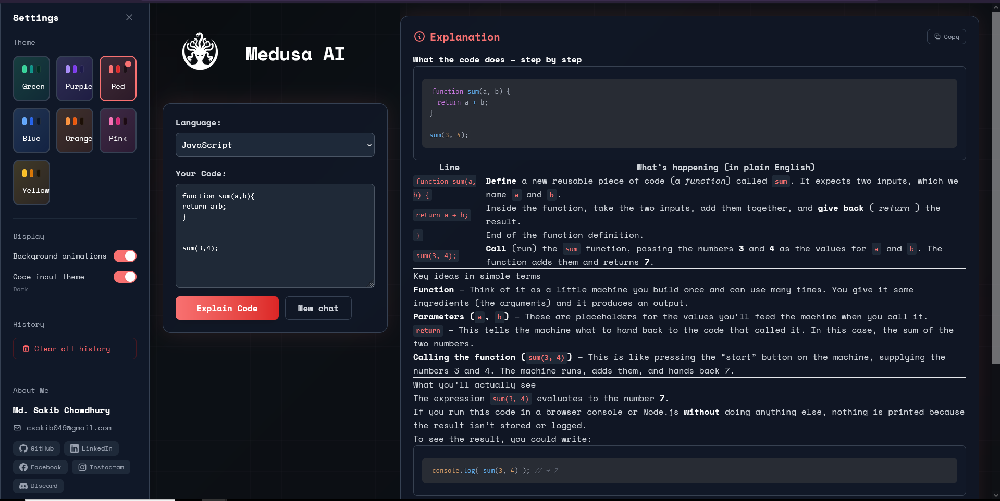

# Medusa AI

Medusa AI is a code explanation tool that helps you understand code in any programming language. Paste your code, select the language, and get a detailed breakdown.

**Live:** [https://medusa-ai-front.onrender.com/](https://medusa-ai-front.onrender.com/)

## Screenshots

### Home


### Settings


### Languages


## Features

- **AI-powered code explanation** — Get clear, detailed explanations for any code snippet
- **16 programming languages** — JavaScript, TypeScript, Python, Java, C++, C#, Go, Rust, Ruby, PHP, Swift, Kotlin, SQL, HTML, CSS, Bash
- **7 themes** — Green, Purple, Red, Blue, Orange, Pink, Yellow
- **Code input theme toggle** — Switch between dark and light input areas
- **Background animations** — Can be toggled on/off in settings
- **Chat history** — Sidebar keeps track of all past explanations; export or clear anytime
- **Responsive design** — Works on desktop and mobile

## Run Locally

Clone the repo and install dependencies:

```bash
cd Medusa ai
npm install
```

### Terminal 1 — Frontend

```bash
cd codesplain
npm run dev
```

### Terminal 2 — Backend

```bash
cd Server
npm run dev
```

Open the URL shown in the frontend terminal (default: `http://localhost:5173`).

## Settings

- **Theme** — Pick from 7 accent color themes
- **Background animations** — Toggle the animated background on/off
- **Code input theme** — Switch between dark/light editor background
- **Clear all history** — Remove all past explanations at once
- **About** — Links to the developer's GitHub, LinkedIn, Facebook, Instagram, Discord

Built with React 19, Tailwind CSS 4, and Express.
